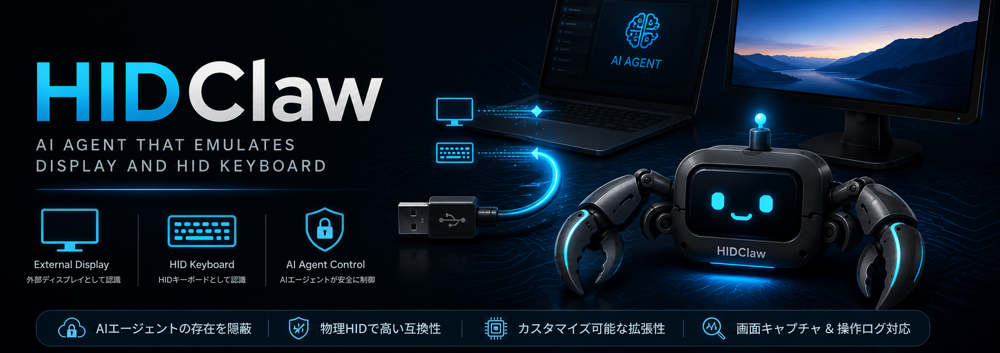
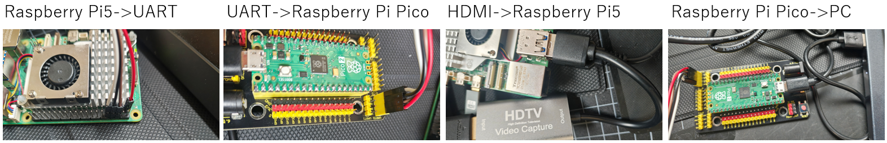
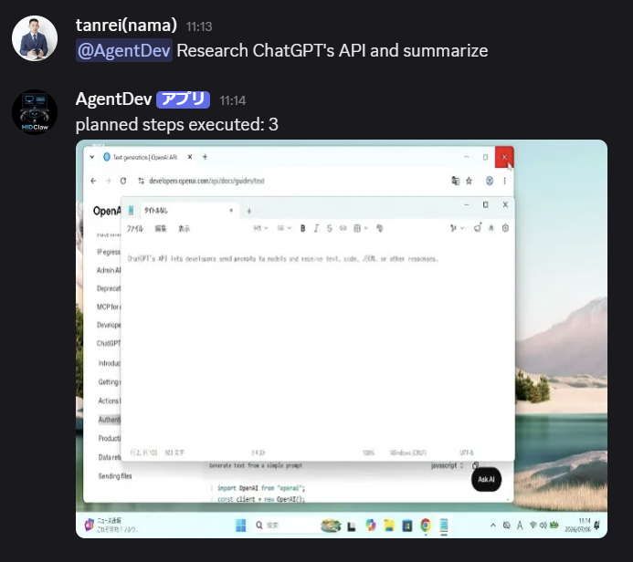

# HIDClaw

PC を**物理的に操作**する AI エージェントです。



HIDClaw は対象 PC に専用ソフトウェアを入れずに PC 操作を行います。Raspberry Pi 5、Raspberry Pi Pico / Pico 2、HDMI キャプチャーデバイスを組み合わせて、Pi 5 が HDMI キャプチャーで画面を読み取り、OpenAI Computer Use API から得た操作を UART 経由で Pico へ送り、Pico が USB HID デバイスとして対象 PC を操作します。

## Demo

[動作動画を見る](https://youtu.be/BOC1nILZCNE)

動画では、Raspberry Pi 5 上の WebUI から PC 操作リクエストを入力し、画面キャプチャー、Computer Use API 呼び出し、Pico への HID コマンド送信、対象 PC 操作までの流れを確認できます。

## Hardware

- Raspberry Pi 5
- Raspberry Pi Pico / Pico 2
- USB HDMI キャプチャーデバイス
- 操作対象 PC



```text
対象 PC
├─ HDMI OUT ── USB HDMI Capture Board ── Raspberry Pi 5
└─ USB IN   ── Raspberry Pi Pico / Pico 2

Raspberry Pi 5
├─ HDMI キャプチャーで対象 PC の画面を取得
├─ UART で Pico へ操作コマンドを送信
└─ WebUI / Discord / CLI から操作を受け付け

Raspberry Pi Pico / Pico 2
├─ UART で Pi 5 からコマンドを受信
└─ USB HID Keyboard / Mouse として対象 PC を操作
```

UART 配線:

```text
Raspberry Pi 5 GPIO14 TXD -> Pico GP1 / UART0 RX
Raspberry Pi 5 GPIO15 RXD <- Pico GP0 / UART0 TX
Raspberry Pi 5 GND        <-> Pico GND
```

## What You Can Do

- WebUI から自然言語で対象 PC を操作する
- Plan モードで複数ステップの操作計画を作ってから実行する
- Manual HID で `KEY WIN+R` や `TEXT hello` などの低レベルコマンドを直接送る
- Emergency Stop / Suspend / Resume で操作を止める
- 操作ログ、スクリーンショット、トークン使用量を保存する
- メール通知と Discord からの操作に対応する

## Quick Start

Pi 5 上で WebUI を起動します。

```sh
python3 pi/app.py --mode web --config config/example.toml
```

ブラウザで開きます。

```text
http://127.0.0.1:8080/
```

詳しい起動方法、設定ファイル、Request / Plan / Manual HID、メール通知、Discord bot の設定は [HOW_TO_USE.md](HOW_TO_USE.md) を参照してください。

## Discord

Discordアプリを作成しAPIキーを登録すると、Discordのチャットから操作ができるようになります。




## Documents

- [HOW_TO_USE.md](HOW_TO_USE.md): 使い方と設定＆免責事項
- [docs/DISCORD_COMMANDS.md](docs/DISCORD_COMMANDS.md): Discord コマンドのリファレンス
- [docs/PRODUCT_SPEC.md](docs/PRODUCT_SPEC.md): 開発仕様
- [docs/TESTING.md](docs/TESTING.md): テスト手順
